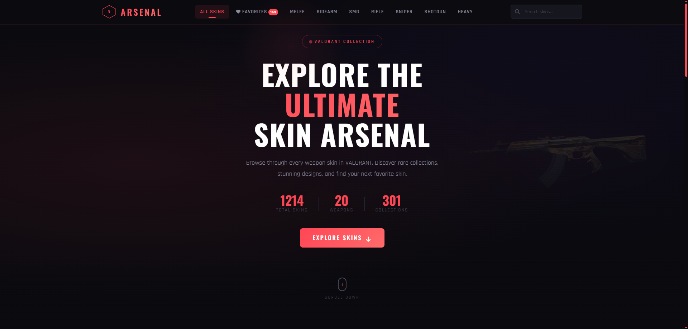



# V ARSENAL — VALORANT Skin Showcase

Fan-made bir **VALORANT skin arşivi** web uygulaması.  
VALORANT API üzerinden silahları, skinleri ve koleksiyonları (bundles) dinamik olarak listeler; skin detaylarında **Chromas**, **Levels** ve varsa **Video Preview** gösterir.

> Disclaimer: This is a fan-made project. VALORANT is a registered trademark of Riot Games. All skin images and data are property of Riot Games.

## Preview

## Live Demo
https://yeet4devv.github.io/valorant_skins/

## Features
- Weapon kategorilerine göre filtreleme (Melee, Sidearm, SMG, Rifle, Sniper, Shotgun, Heavy)
- Arama (weapon veya skin isimlerinde)
- Featured “Popular Collections” (bundles)
- Weapon modal: seçilen silahın skinlerini görüntüleme
- Skin detail modal:
  - Favorites (localStorage ile kalıcı)
  - Chromas
  - Levels
  - Streamed video preview (varsa)
- Skeleton loading, error state ve retry akışı
- Responsive tasarım + prefers-reduced-motion desteği

## Tech Stack
- HTML / CSS / JavaScript (Vanilla)
- Data Source: https://valorant-api.com

## Run Locally
`ash
git clone https://github.com/yeet4devv/valorant_skins.git
cd valorant_skins
python -m http.server 5500
Open: http://localhost:5500

License
MIT — see LICENSE
